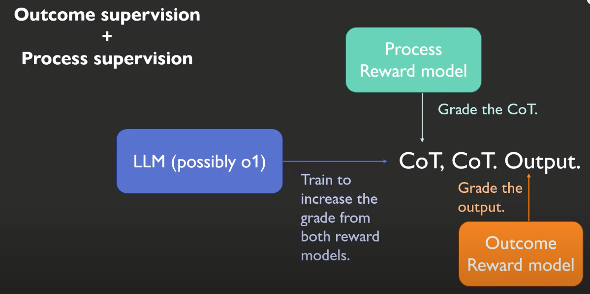

# LLM RL Notes

面向大模型训练、强化学习、推理增强与推理基础设施的 notebook 笔记库。内容以「概念推导 + 代码实验 + 工程实践」为主，覆盖 RL 基础、RLHF/GRPO、reward、tokenizer、vLLM/verl/SGLang/Ray、Agent RL 与 reasoning 等主题。



## 快速开始

```bash
cd rl-main
python -m venv .venv
source .venv/bin/activate
pip install -U pip
pip install -r requirements.txt
jupyter lab
```

部分 notebook 会依赖 GPU、Ollama、本地/远程模型、API key 或分布式推理框架。需要这些能力时，再按需安装 `requirements-optional.txt`：

```bash
pip install -r requirements-optional.txt
```

如果使用 K2 / Agent / 搜索相关示例，可以复制 `.env.example` 为 `.env` 后填入本地密钥。

## 目录导航

| 路径 | 内容 |
| --- | --- |
| `o1_overall.ipynb`, `o1_实现.ipynb` | o1 / reasoning 训练范式的整体理解与实现笔记 |
| `pt_sft_rl.ipynb` | 预训练、SFT、RL 的关系速览 |
| `tutorials/basics_insights_of_RL/` | MDP、Bellman、PG、PPO、DQN、SARSA/Q-learning、importance sampling 等 RL 基础 |
| `tutorials/objectives_adv/` | KL regularization、GAE、GRPO loss、objective 设计 |
| `tutorials/RLHF/` | Bradley-Terry、RLHF、ORPO/TRPO/PPO |
| `tutorials/r1-k1.5/` | DeepSeek-R1 / K1.5、GRPO、复现讨论、TRL GRPO 实践 |
| `tutorials/rewards/` | reward 基础、format reward、pass@k、GRM/SPCT |
| `tutorials/tokenizer/` | chat template、response prefill、padding side、reasoning model inference |
| `tutorials/search-learn/` | MCTS、LLM beam search、test-time compute scaling |
| `tutorials/infra/` | vLLM、SGLang、verl、Ray、FlashInfer、显存管理与推理部署 |
| `tutorials/RL4Agents/` | Agent RL、multi-turn rollout、tool GRPO、verl agent loop |
| `tutorials/reasoning/` | DeepConf、AlphaGeometry、Ollama/Streamlit reasoning demo |
| `tutorials/k2/` | K2、Muon、agentic workflow 相关笔记与脚本 |
| `tutorials/misc/`, `tutorials/hf/`, `tutorials/data/`, `tutorials/vlm/` | PyTorch/LLM 实践、Hugging Face、数据污染、VLM 等补充主题 |

## 推荐学习路径

1. `pt_sft_rl.ipynb`
2. `tutorials/llm_as_mdp.ipynb`
3. `tutorials/basics_insights_of_RL/RL_intuitives.ipynb`
4. `tutorials/basics_insights_of_RL/pg.ipynb`
5. `tutorials/objectives_adv/kl_regularized.ipynb`
6. `tutorials/objectives_adv/gae.ipynb`
7. `tutorials/objectives_adv/grpo_loss.ipynb`
8. `tutorials/RLHF/RLHF.ipynb`
9. `tutorials/r1-k1.5/r1-paper.ipynb`
10. `tutorials/infra/overall_vllm.ipynb`

## 工程说明

- notebook 是主要载体，脚本集中在各主题目录下的 `scripts/` 或 demo 文件中。
- `.env`、模型权重、训练输出、缓存、checkpoint、wandb 日志等本地文件不会入库。
- GPU/分布式相关 notebook 可能需要 Linux + CUDA 环境；macOS 上建议优先阅读和运行轻量 notebook。
- `requirements.txt` 只放通用学习依赖；推理服务、RL 训练框架和 API demo 依赖放在 `requirements-optional.txt`。
